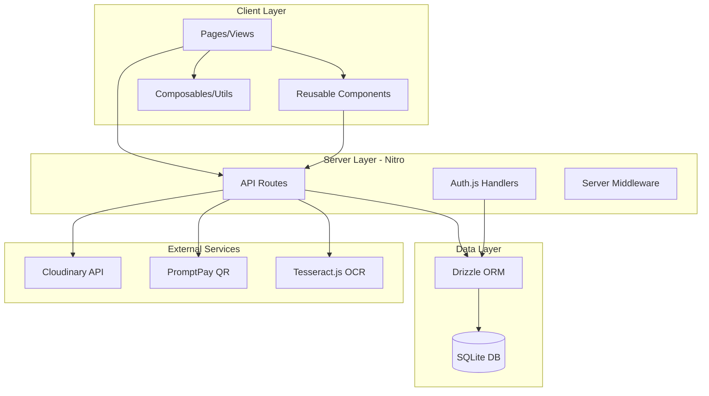
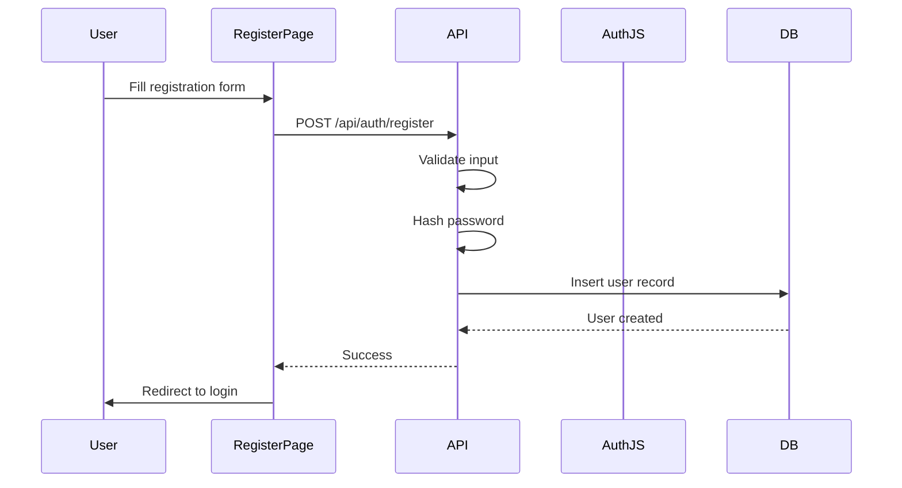
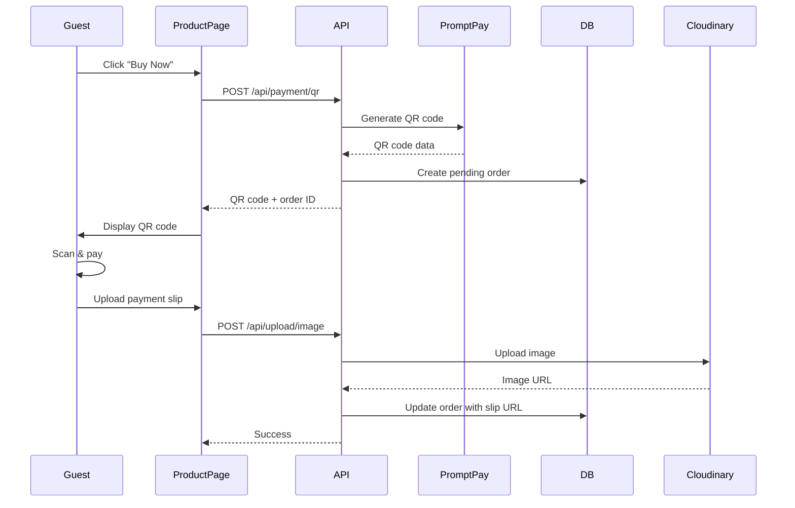
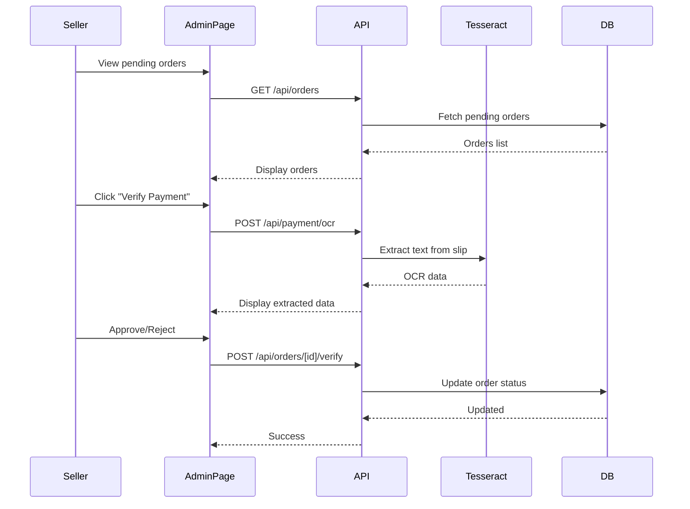

# Design Document

## Overview

This e-commerce platform is a Nuxt 3 application that allows guest users to browse and purchase products using PromptPay payments, while authenticated sellers manage products and verify payments. The architecture follows Nuxt 3 best practices with a clear separation between client-side pages/components and server-side API routes powered by Nitro.

### Key Design Principles

1. **Beginner-Friendly**: Simple, well-commented code with clear naming conventions
2. **Guest-First**: No authentication required for browsing and purchasing
3. **Type-Safe**: Full TypeScript coverage with explicit types
4. **Modular**: Reusable components and utilities
5. **Deployment-Ready**: Configured for NuxtHub with SQLite

## Architecture

### High-Level Architecture



### Directory Structure

```
app/
├── assets/
│   └── css/
│       └── main.css              # Global Tailwind styles
├── components/
│   ├── ui/
│   │   ├── Button.vue            # Reusable button component
│   │   ├── Input.vue             # Reusable input component
│   │   ├── Modal.vue             # Modal dialog component
│   │   └── LoadingSpinner.vue    # Loading indicator
│   ├── layout/
│   │   ├── Navbar.vue            # Navigation bar
│   │   └── Footer.vue            # Footer
│   └── product/
│       ├── ProductCard.vue       # Product card display
│       ├── ProductGrid.vue       # Grid of product cards
│       └── ProductForm.vue       # Product create/edit form
├── pages/
│   ├── index.vue                 # Home/Product listing
│   ├── products/
│   │   └── [id].vue              # Product detail page
│   ├── auth/
│   │   ├── login.vue             # Login page
│   │   └── register.vue          # Registration page
│   └── admin/
│       ├── index.vue             # Admin dashboard
│       ├── products.vue          # Product management
│       └── orders.vue            # Order verification
├── composables/
│   ├── useAuth.ts                # Authentication composable
│   ├── useProducts.ts            # Product operations
│   └── useOrders.ts              # Order operations
└── app.vue                       # Root component with layout

server/
├── api/
│   ├── products/
│   │   ├── index.get.ts          # Get all products
│   │   ├── index.post.ts         # Create product
│   │   ├── [id].get.ts           # Get single product
│   │   ├── [id].put.ts           # Update product
│   │   └── [id].delete.ts        # Delete product
│   ├── orders/
│   │   ├── index.post.ts         # Create order
│   │   ├── index.get.ts          # Get all orders (admin)
│   │   ├── [id].get.ts           # Get order details
│   │   └── [id]/verify.post.ts   # Verify payment
│   ├── payment/
│   │   ├── qr.post.ts            # Generate PromptPay QR
│   │   └── ocr.post.ts           # OCR payment slip
│   └── upload/
│       └── image.post.ts         # Upload to Cloudinary
├── db/
│   ├── schema.ts                 # Drizzle schema definitions
│   ├── index.ts                  # Database connection
│   └── migrations/               # Database migrations
├── utils/
│   ├── cloudinary.ts             # Cloudinary helper
│   ├── promptpay.ts              # PromptPay QR generator
│   └── ocr.ts                    # Tesseract OCR wrapper
└── middleware/
    └── auth.ts                   # Auth middleware for protected routes

types/
└── index.ts                      # Shared TypeScript types
```

## Components and Interfaces

### Database Schema (Drizzle ORM)

```typescript
// server/db/schema.ts

import { sqliteTable, text, integer, real } from "drizzle-orm/sqlite-core";

// Users table for sellers/admins
export const users = sqliteTable("users", {
  id: integer("id").primaryKey({ autoIncrement: true }),
  firstName: text("first_name").notNull(),
  lastName: text("last_name").notNull(),
  email: text("email").notNull().unique(),
  password: text("password").notNull(), // Hashed
  role: text("role").notNull().default("seller"), // seller, admin
  createdAt: integer("created_at", { mode: "timestamp" }).notNull(),
});

// Products table
export const products = sqliteTable("products", {
  id: integer("id").primaryKey({ autoIncrement: true }),
  name: text("name").notNull(),
  description: text("description").notNull(),
  price: real("price").notNull(),
  imageUrl: text("image_url").notNull(),
  stock: integer("stock").notNull().default(0),
  createdAt: integer("created_at", { mode: "timestamp" }).notNull(),
  updatedAt: integer("updated_at", { mode: "timestamp" }).notNull(),
});

// Orders table
export const orders = sqliteTable("orders", {
  id: integer("id").primaryKey({ autoIncrement: true }),
  productId: integer("product_id")
    .notNull()
    .references(() => products.id),
  customerName: text("customer_name"),
  customerEmail: text("customer_email"),
  customerPhone: text("customer_phone"),
  quantity: integer("quantity").notNull().default(1),
  totalAmount: real("total_amount").notNull(),
  paymentSlipUrl: text("payment_slip_url"),
  status: text("status").notNull().default("pending"), // pending, verified, rejected
  ocrData: text("ocr_data"), // JSON string of extracted OCR data
  createdAt: integer("created_at", { mode: "timestamp" }).notNull(),
  verifiedAt: integer("verified_at", { mode: "timestamp" }),
  verifiedBy: integer("verified_by").references(() => users.id),
});
```

### TypeScript Interfaces

```typescript
// types/index.ts

export interface User {
  id: number;
  firstName: string;
  lastName: string;
  email: string;
  role: "seller" | "admin";
  createdAt: Date;
}

export interface Product {
  id: number;
  name: string;
  description: string;
  price: number;
  imageUrl: string;
  stock: number;
  createdAt: Date;
  updatedAt: Date;
}

export interface Order {
  id: number;
  productId: number;
  product?: Product;
  customerName?: string;
  customerEmail?: string;
  customerPhone?: string;
  quantity: number;
  totalAmount: number;
  paymentSlipUrl?: string;
  status: "pending" | "verified" | "rejected";
  ocrData?: OCRData;
  createdAt: Date;
  verifiedAt?: Date;
  verifiedBy?: number;
}

export interface OCRData {
  amount?: string;
  date?: string;
  reference?: string;
  rawText: string;
}

export interface CreateProductDTO {
  name: string;
  description: string;
  price: number;
  imageUrl: string;
  stock: number;
}

export interface CreateOrderDTO {
  productId: number;
  customerName?: string;
  customerEmail?: string;
  customerPhone?: string;
  quantity: number;
}

export interface VerifyOrderDTO {
  orderId: number;
  status: "verified" | "rejected";
}
```

## Data Models

### Authentication Flow



### Guest Purchase Flow



### Payment Verification Flow



## Error Handling

### Client-Side Error Handling

1. **Form Validation**: Use Zod schemas for input validation before API calls
2. **API Error Display**: Show user-friendly error messages in modals or toast notifications
3. **Loading States**: Display LoadingSpinner during async operations
4. **Network Errors**: Catch Axios errors and display appropriate messages

```typescript
// Example error handling pattern
try {
  const response = await $fetch("/api/products", {
    method: "POST",
    body: productData,
  });
  // Success handling
} catch (error) {
  if (error.statusCode === 400) {
    // Validation error
  } else if (error.statusCode === 401) {
    // Unauthorized
  } else {
    // Generic error
  }
}
```

### Server-Side Error Handling

1. **Input Validation**: Validate all inputs using Zod schemas
2. **Database Errors**: Catch and log database errors, return generic messages to client
3. **External Service Errors**: Handle Cloudinary, OCR failures gracefully
4. **Authentication Errors**: Return appropriate HTTP status codes (401, 403)

```typescript
// Example API route error handling
export default defineEventHandler(async (event) => {
  try {
    // Validate input
    const body = await readBody(event);
    const validated = productSchema.parse(body);

    // Process request
    const result = await db.insert(products).values(validated);
    return result;
  } catch (error) {
    if (error instanceof ZodError) {
      throw createError({
        statusCode: 400,
        message: "Validation failed",
        data: error.errors,
      });
    }
    throw createError({
      statusCode: 500,
      message: "Internal server error",
    });
  }
});
```

### Error Response Format

```typescript
interface ErrorResponse {
  statusCode: number;
  message: string;
  data?: any; // Additional error details
}
```

## Testing Strategy

### Unit Testing (Optional - for learning)

Focus on testing utility functions and composables:

1. **Utility Functions**: Test PromptPay QR generation, OCR text extraction
2. **Composables**: Test useAuth, useProducts, useOrders logic
3. **Validation Schemas**: Test Zod schemas with valid/invalid inputs

### Integration Testing (Optional - for learning)

Test API routes with mock database:

1. **Product CRUD**: Test create, read, update, delete operations
2. **Order Creation**: Test order creation and payment slip upload
3. **Authentication**: Test registration, login, session management

### Manual Testing Checklist

1. **Guest Flow**:
   - Browse products without login
   - View product details
   - Generate PromptPay QR code
   - Upload payment slip

2. **Seller Flow**:
   - Register new account
   - Login with credentials
   - Create new product with image
   - Edit existing product
   - Delete product
   - View pending orders
   - Verify payment using OCR
   - Approve/reject orders

3. **Responsive Design**:
   - Test on mobile (375px)
   - Test on tablet (768px)
   - Test on desktop (1024px+)

## Technical Implementation Details

### Auth.js Configuration

```typescript
// server/api/auth/[...].ts
import { NuxtAuthHandler } from "#auth";
import CredentialsProvider from "next-auth/providers/credentials";

export default NuxtAuthHandler({
  providers: [
    CredentialsProvider({
      name: "Credentials",
      credentials: {
        email: { label: "Email", type: "email" },
        password: { label: "Password", type: "password" },
      },
      async authorize(credentials) {
        // Verify credentials against database
        // Return user object if valid
      },
    }),
  ],
  session: {
    strategy: "jwt",
  },
  pages: {
    signIn: "/auth/login",
  },
});
```

### Drizzle ORM Setup

```typescript
// server/db/index.ts
import { drizzle } from "drizzle-orm/better-sqlite3";
import Database from "better-sqlite3";
import * as schema from "./schema";

const sqlite = new Database("data.db");
export const db = drizzle(sqlite, { schema });
```

### Cloudinary Integration

```typescript
// server/utils/cloudinary.ts
import { v2 as cloudinary } from "cloudinary";

cloudinary.config({
  cloud_name: process.env.CLOUDINARY_CLOUD_NAME,
  api_key: process.env.CLOUDINARY_API_KEY,
  api_secret: process.env.CLOUDINARY_API_SECRET,
});

export async function uploadImage(base64Image: string) {
  const result = await cloudinary.uploader.upload(base64Image, {
    folder: "ecommerce-products",
  });
  return result.secure_url;
}
```

### PromptPay QR Generation

```typescript
// server/utils/promptpay.ts
import generatePayload from "promptpay-qr";
import QRCode from "qrcode";

export async function generatePromptPayQR(
  phoneNumber: string,
  amount: number,
): Promise<string> {
  const payload = generatePayload(phoneNumber, { amount });
  const qrCodeDataURL = await QRCode.toDataURL(payload);
  return qrCodeDataURL;
}
```

### Tesseract.js OCR

```typescript
// server/utils/ocr.ts
import { createWorker } from "tesseract.js";

export async function extractTextFromImage(imageUrl: string): Promise<string> {
  const worker = await createWorker("eng+tha");
  const {
    data: { text },
  } = await worker.recognize(imageUrl);
  await worker.terminate();
  return text;
}

export function parsePaymentSlip(text: string): OCRData {
  // Parse extracted text to find amount, date, reference
  // This is a simplified example - actual implementation needs regex patterns
  const amountMatch = text.match(/(\d+\.\d{2})/);
  const dateMatch = text.match(/(\d{2}\/\d{2}\/\d{4})/);

  return {
    amount: amountMatch?.[0],
    date: dateMatch?.[0],
    rawText: text,
  };
}
```

### Environment Variables

```env
# .env
DATABASE_URL=file:./data.db
CLOUDINARY_CLOUD_NAME=your_cloud_name
CLOUDINARY_API_KEY=your_api_key
CLOUDINARY_API_SECRET=your_api_secret
PROMPTPAY_PHONE=0812345678
AUTH_SECRET=your_auth_secret
```

## UI/UX Design Patterns

### Component Patterns

1. **Button Component**: Variants (primary, secondary, danger), sizes (sm, md, lg), loading state
2. **Input Component**: Types (text, email, password, number), validation states, error messages
3. **Modal Component**: Backdrop, close button, header/body/footer slots
4. **ProductCard**: Image, title, price, "View Details" button
5. **LoadingSpinner**: Centered overlay with spinner animation

### Page Layouts

1. **Public Pages**: Navbar + Content + Footer
2. **Admin Pages**: Navbar + Sidebar + Content
3. **Auth Pages**: Centered card layout with form

### Responsive Breakpoints

- Mobile: < 640px
- Tablet: 640px - 1024px
- Desktop: > 1024px

## Deployment Considerations

### NuxtHub Configuration

1. **Database**: SQLite file stored in persistent storage
2. **Environment Variables**: Configure in NuxtHub dashboard
3. **Build Command**: `npm run build`
4. **Output**: `.output` directory

### Pre-Deployment Checklist

1. Set all environment variables
2. Run database migrations
3. Test authentication flow
4. Verify Cloudinary integration
5. Test PromptPay QR generation
6. Verify OCR functionality
7. Check responsive design on all devices

## Security Considerations

1. **Password Hashing**: Use bcrypt or Argon2 for password hashing
2. **SQL Injection**: Drizzle ORM provides protection
3. **XSS Protection**: Vue 3 auto-escapes template content
4. **CSRF Protection**: Auth.js handles CSRF tokens
5. **File Upload Validation**: Validate file types and sizes before Cloudinary upload
6. **Rate Limiting**: Consider adding rate limiting to API routes
7. **Environment Variables**: Never commit .env files to version control
